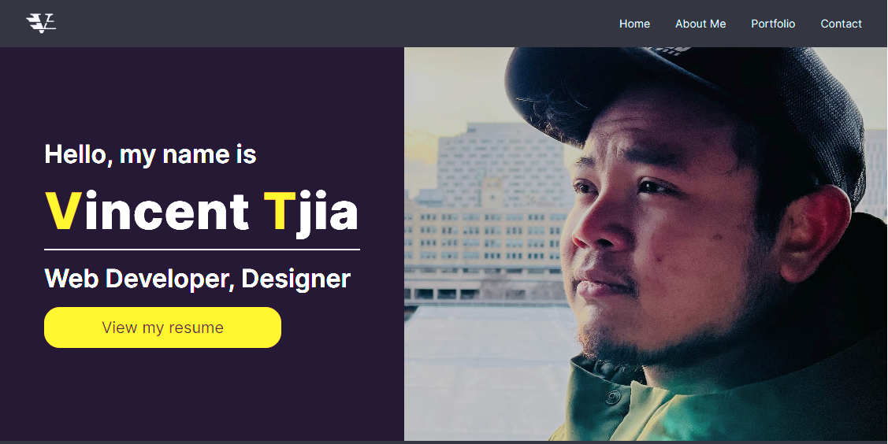
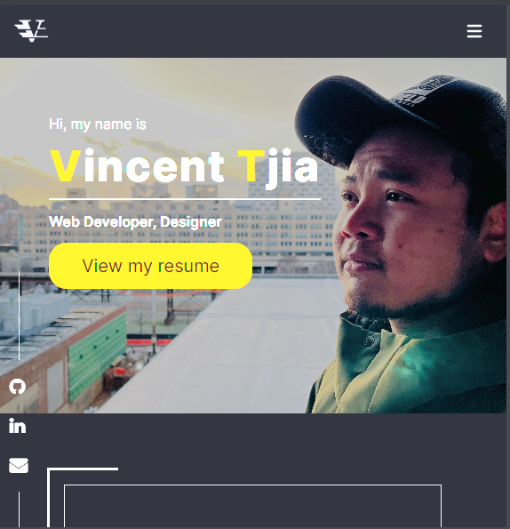

# personal-portfolio ver.3.0
Personal portfolio website. This is the 3.0 version of my site under the repo "vtjia.github.io". This version 
contains the latest portfolio works, updated skills, and fully responsive UI compared to its predecessors. 
I've utilized the CSS framework called "tailwind css" to improve its responsitivity to given breaking points and layout. 
I've also began to experiment with custom css animations from Animate.css and tailwind css to add some personality to the site.  

## URL
Deployed: https://binnie51.github.io/portfolio3.0/

## Technologies
* HTML 
* CSS
* JavaScript 
* Tailwind css 
* Animate.css

## Screenshots
### Large-view @media (min-width: 1024px)
Nav menus & hero

### small-view

## License
  
Copyright (c) Vincent Tjia. All rights reserved.